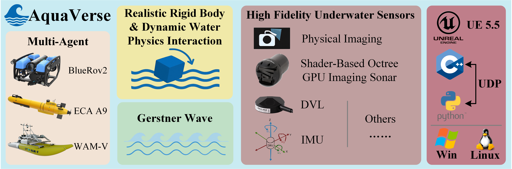

# 🌊 AquaVerse: Augmented Quasi-physical Aquatic Universe for Realistic Underwater Robot Simulation

  

🎮 **High fidelity · Modularity · Multi-Agents**  
🚀 Build a virtual ocean world with real physical interaction to provide a one-stop solution for the development and testing of underwater robots!

## 📌 Project Introduction
Aquaverse is an underwater robot simulation platform based on **unreal engine 5.5**, which integrates the following technologies:
- 🧱 Physical simulation of rigid body 
- 🌊 Gerstner wave sea surface modeling 
- 💦 Dynamic fluid interaction system 
- 🎥 Realistic rendering of underwater image  
- 📡 GPU accelerated multibeam sonar modeling  
- 🤖 Support ROV/AUV/USV multiple robot types

## 🎥 Underwater Image Rendering Preview

  

## 📡 Image and Imaging Sonar Demo

  

## 📡 Formation Demo

  

## 📅 Future Plans

We are actively improving **AquaVerse** to make it more powerful, extensible, and realistic. The following features are under development or planned:

| Feature                          | Status     | Notes                                     |
|----------------------------------|------------|-------------------------------------------|
| 🧠 Update control program and use tutorial| 🟡 Planned | Will be updated after paper was published |

> 🛠 **Status Legend**:  
> 🟢 In Progress 🟡 Planned 🔵 Researching

We welcome suggestions and contributions! Please feel free to open an [issue](https://github.com/your-org/aquaverse/issues) or start a [discussion](https://github.com/your-org/aquaverse/discussions).

