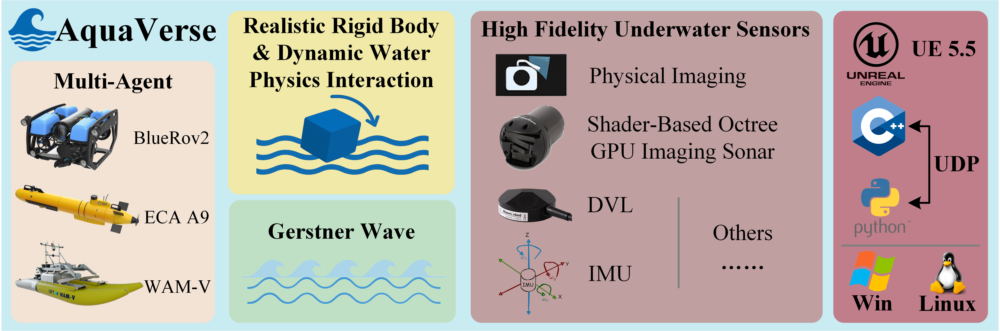
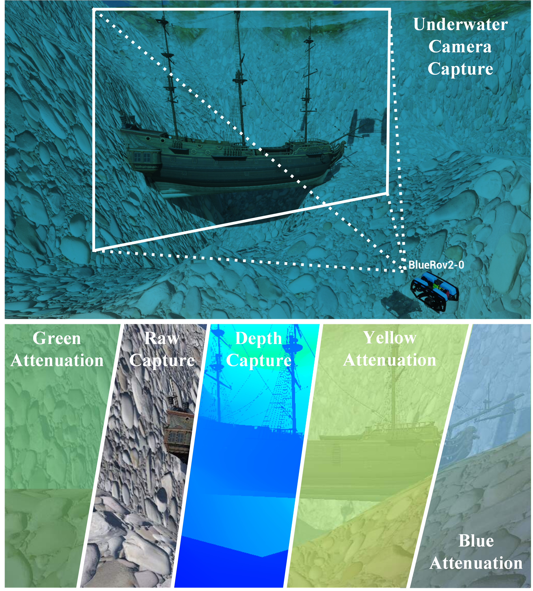
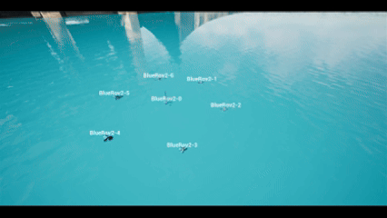

# 🌊 AquaVerse: Augmented Quasi-physical Aquatic Universe for Realistic Underwater Robot Simulation

<div align="center">
  
</div>


🎮 **High fidelity · Modularity · Multi-Agents**  
🚀 Build a virtual ocean world with real physical interaction to provide a one-stop solution for the development and testing of underwater robots!

## 📌 Project Introduction
Aquaverse is an underwater robot simulation platform based on **unreal engine 5.5**, which integrates the following technologies:
- 🧱 Physical simulation of rigid body 
- 🌊 Gerstner wave sea surface modeling 
- 💦 Dynamic fluid interaction system 
- 🎥 Realistic rendering of underwater image  
- 📡 GPU accelerated multibeam sonar modeling  
- 🤖 Support ROV/AUV/USV multiple robot types

## 🎥 Underwater Image Rendering Preview
<div align="center">
  
</div>

## 📡 Image and Imaging Sonar Demo
<div align="center">
  
</div>

## 📡 Formation Demo
<div align="center">
  
</div>

## 📅 Future Plans

We are actively improving **AquaVerse** to make it more powerful, extensible, and realistic. The following features are under development or planned:

| Feature                          | Status     | Notes                                     |
|----------------------------------|------------|-------------------------------------------|
| 🧠 Update control program and use tutorial| 🟡 Planned | Will be updated after paper was published |


> 🛠 **Status Legend**:  
> 🟢 In Progress 🟡 Planned 🔵 Researching

We welcome suggestions and contributions! Please feel free to open an [issue](https://github.com/your-org/aquaverse/issues) or start a [discussion](https://github.com/your-org/aquaverse/discussions).


If you use **AquaVerse** in your research or project, please cite:

```bibtex
@software{aquaverse_2026,
  author = {Jibo Bai},
  title = {AquaVerse: Augmented Quasi-physical Aquatic Universe for Realistic Underwater Robot Simulation},
  year = {2026},
  url = {https://github.com/StarTeardrop/AquaVerse},
}

## 🧭 Usage Tutorial

This section introduces how to quickly deploy and run **AquaVerse** for underwater robot simulation, sensor rendering, and multi-agent experiments.

---

## 🔧 Environment Setup

To ensure stable simulation and high-fidelity sonar rendering, the following environment is recommended:

- 🖥 **OS**: Windows 10 / 11 (64-bit)  
  *(TODO: Ubuntu 20.04 and ROS support)*

- 🎮 **Engine**: Unreal Engine **5.5**

- 🧠 **CPU**: ≥ 8 cores

- 💾 **RAM**: ≥ 16 GB

---

## 📥 Download

You can obtain AquaVerse in one of the following ways:

- 🔗 **AqueVerse UE5 exe file (Recommended)**  
  https://drive.google.com/file/d/1YHAewZmkqE59vu9PGAVMXhlz_rq8Z_zf/view?usp=sharing
---

## 📦 Project Installation

Clone the repository:

```bash
git clone https://github.com/StarTeardrop/AquaVerse.git
cd AquaVerse

next:
RUN: python AquaVerseKeyboard_Control.py
If the python related package is missing, please install it with pip.

AquaVerseKeyboard_Control.py file parameters:
    exe_path = r"E:\Test\Windows\AquaVerse.exe" -->>Change to the address of the 'AquaVerse.exe' executable file extracted after downloading from Google disk
    profile_path = r'C:\Users\21058\Desktop\Profiles' -->> Modify to the 'Profiles' folder address under git directory
If you need to adjust the sensor and robot parameters, please refer to the parameters of each JSON file under the profiles folder (At present, only bluerov2 type robots are supported, and other types will be added in subsequent versions)
